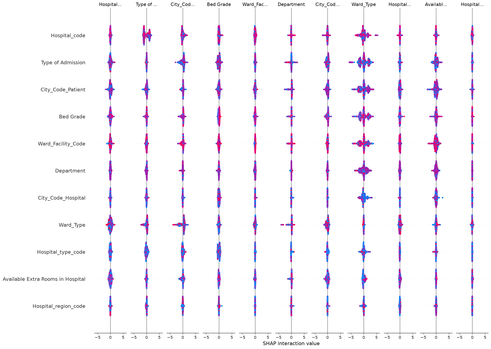
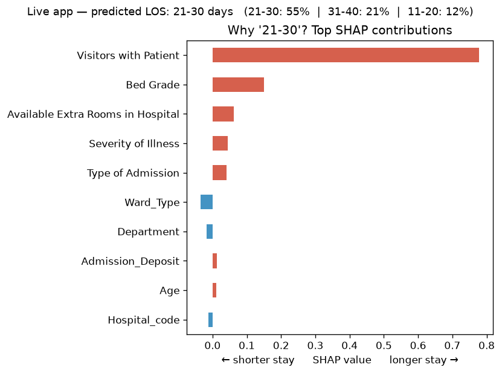
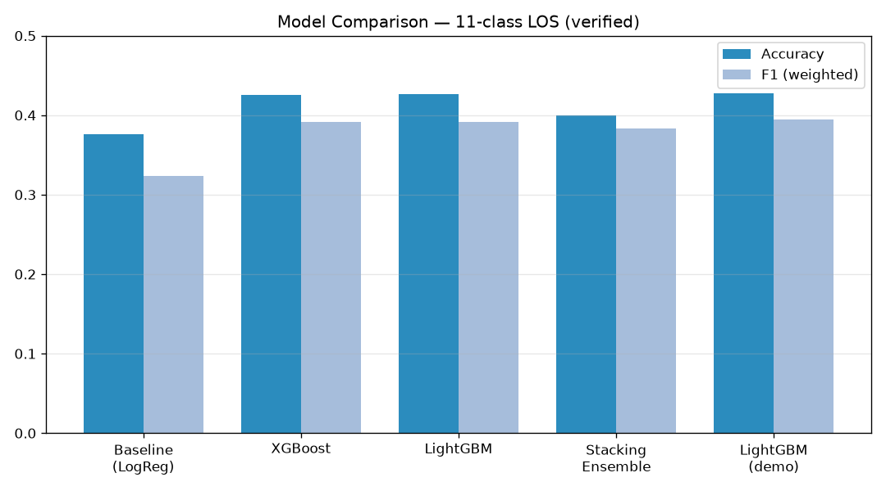
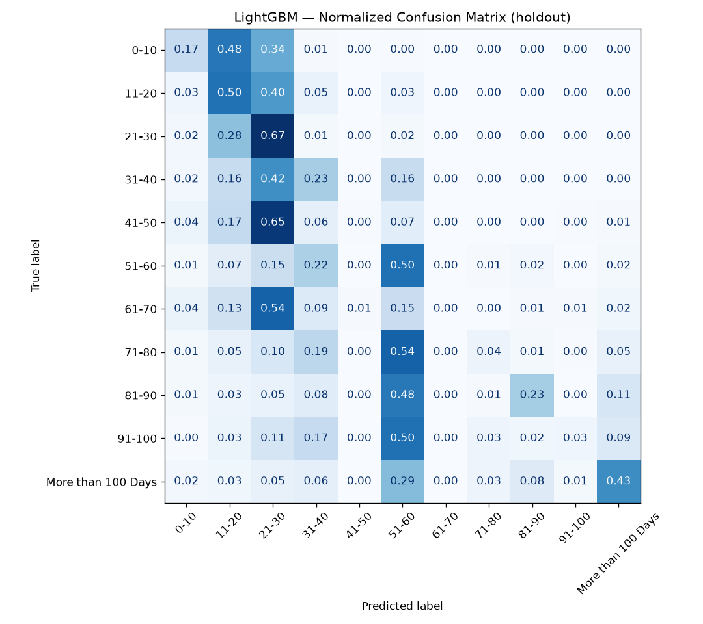
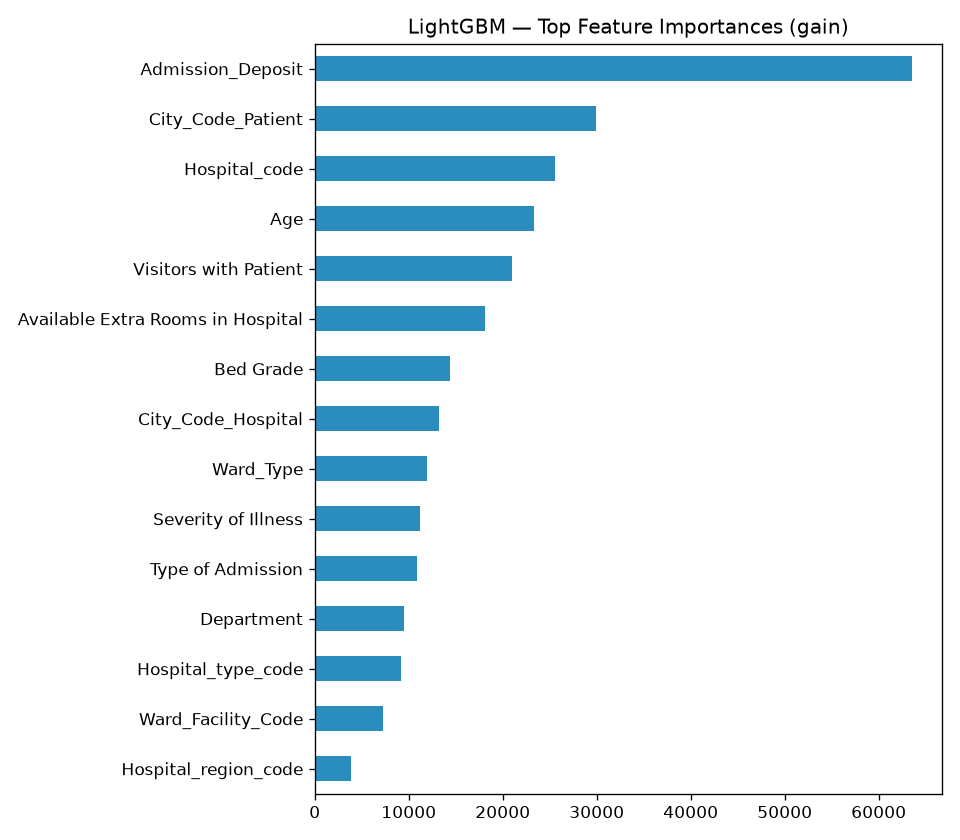

# 🏥 Hospital Length-of-Stay Prediction

**Predict a patient's hospital Length of Stay (LOS) at admission time** — an
11-class problem — using gradient-boosting models, a stacking ensemble,
hyperparameter tuning, experiment tracking, and SHAP explainability. Includes a
**live Gradio demo** that explains every prediction.

> Accurate LOS prediction helps hospitals plan beds, staffing, and discharge —
> reducing crowding and cost. This repo treats it as a rigorous, honest ML study:
> several model families are compared on equal footing, and results are reported
> as measured — including where the fancy ensemble *didn't* win.

---

## ✨ Highlights

- **6 model families compared** on identical stratified CV: Logistic-Regression
  baseline, **XGBoost**, **LightGBM**, **CatBoost**, a TensorFlow MLP, and a
  **stacking ensemble**.
- **Explainability first** — global **SHAP** + per-prediction explanations are
  the differentiator, not an afterthought (see below).
- **Tuning + tracking** — **Optuna** Bayesian search, **MLflow** experiment
  logging, YAML-driven config.
- **Live demo** — a self-contained **Gradio** app (`app.py`) that predicts LOS
  and shows *why* via SHAP.
- **Honest reporting** — on this hard 11-class task the best models land
  ~**43% accuracy**; the stacking ensemble did **not** beat single boosters on
  accuracy (it did improve minority-class macro-F1). That nuance is kept, not
  hidden.

## 🔬 Explainability (the differentiator)

Global feature attribution with SHAP shows admission-time drivers of LOS, and the
live app produces a **per-patient** SHAP breakdown for each prediction.

| Global SHAP summary | Per-prediction explanation (live app) |
|---|---|
|  |  |

`Visitors with Patient`, `Ward_Type`, `Bed Grade`, and `Severity of Illness`
consistently rank among the strongest signals.

## 📊 Results (verified)

11-class classification of the `Stay` bucket. Low absolute accuracy is inherent
to the problem (11 imbalanced classes; random ≈ 9%). Numbers below are read from
saved run artifacts or reproduced in-repo — none are copied unverified.

| Model | Accuracy | F1 (weighted) | F1 (macro) | Provenance |
|------|:---:|:---:|:---:|---|
| Baseline — Logistic Regression | 0.376 | 0.324 | 0.168 | saved report |
| XGBoost | 0.425 | 0.391 | 0.260 | saved report |
| **LightGBM** | **0.426** | **0.392** | 0.261 | saved report |
| CatBoost | 0.419 | 0.381 | 0.236 | reproduced (untuned, 300 iters) |
| Stacking ensemble (XGB+LGB+RF → LogReg) | 0.400 | 0.383 | **0.277** | saved report |
| Neural network (TF MLP) | — | — | — | implemented; not reproduced here |



**Takeaways:** gradient boosting (LightGBM/XGBoost) is the practical winner
(~42.6%). The stacking ensemble traded a little overall accuracy for the best
**macro-F1** (0.277) — i.e. more balanced performance across rare long-stay
classes. The TensorFlow MLP is implemented in `src/models/` but its metrics were
not reproduced in this pass, so no number is claimed.

| Confusion matrix (LightGBM) | Feature importance |
|---|---|
|  |  |

## 🧠 Approach

1. **EDA & preprocessing** — impute `Bed Grade` / `City_Code_Patient`, ordinal-map
   `Age`, encode categoricals, drop ID columns. (`src/data/`, notebooks 01–02)
2. **Base learners** — boosting models excel on this tabular, mixed-type data;
   LightGBM/XGBoost/CatBoost give strong, fast baselines. (`src/models/`)
3. **Stacking ensemble** — base-model out-of-fold probabilities feed a
   Logistic-Regression meta-model, with proper CV to prevent leakage.
   (`src/models/ensemble_model.py`)
4. **Tuning** — Optuna Bayesian search over booster hyperparameters
   (`results/metrics/*_study.pkl`, `*_param_importance.csv`).
5. **Explainability** — SHAP global + per-prediction; permutation importance.
   (`src/evaluation/interpretability.py`)

## 🛠️ Tech stack — and how each piece is used

| Tool | Role in this project | Verified |
|---|---|:---:|
| XGBoost / LightGBM / CatBoost | Gradient-boosting base learners | ✅ |
| scikit-learn | Stacking meta-model, CV, metrics | ✅ |
| TensorFlow | MLP base learner | ⚠️ code only |
| Optuna | Bayesian hyperparameter tuning | ✅ |
| MLflow | Experiment / param / metric tracking | ✅ |
| SHAP | Global + per-prediction explainability | ✅ |
| Gradio | Live demo app | ✅ |

## 🚀 Quick start

```bash
# 1. Environment (Python 3.10–3.11 recommended; 3.12+ may lack some wheels)
python -m venv .venv && source .venv/bin/activate
pip install -r requirements.txt          # full project
#   …or just the demo:
pip install -r requirements-app.txt

# 2. Data — runs out of the box on the committed 1k-row sample.
#    For full-scale training, download train.csv/test.csv to data/raw/ (see data/README.md)

# 3. Train the demo model + regenerate all plots (uses data/raw/train.csv)
python scripts/build_demo.py --data data/raw/train.csv
#   quick smoke run on the sample:
python scripts/build_demo.py --data data/sample/train_sample.csv --sample-rows 1000

# 4. Launch the live demo
python app.py        # → http://127.0.0.1:7860
```

The committed `models/demo/` artifacts let `app.py` run **without retraining**.

## 🌐 Live demo (deploy free on Hugging Face Spaces)

`app.py` is Spaces-ready. To publish:

1. Create a new **Space** → SDK **Gradio**.
2. Add these files: `app.py`, `models/demo/`, and rename **`requirements-app.txt`
   → `requirements.txt`** in the Space (Spaces auto-installs from `requirements.txt`).
3. Push — the Space builds and serves the app. (No GPU needed.)

See [`docs/SCREENSHOTS.md`](docs/SCREENSHOTS.md) for capturing the README images
and the live-app screenshot.

## 🗂️ Project structure

```
src/            data → models → evaluation → visualization (packaged pipeline)
scripts/        build_demo.py (self-contained train+assets), train/evaluate/predict
notebooks/      01–05 narrative pipeline (EDA → training → interpretation → demo)
app.py          Gradio live demo (LOS prediction + SHAP)
models/demo/    committed demo model + preprocessor (powers the app)
docs/img/       README plots
data/           sample/ (committed) + raw/ (gitignored); see data/README.md
results/        saved metrics, figures, reports
config/         YAML config (paths, model params, logging)
tests/          pytest suite (coverage gate 80%)
```

## ✅ Testing

```bash
pytest tests/ -v        # coverage gate: 80% (pytest.ini)
```

## 📌 Notes & honesty

- Public **Healthcare Analytics II** dataset — synthetic / de-identified, **no
  real PII**. Full data is **not committed**; a 1k-row sample is. See
  [`data/README.md`](data/README.md).
- Some legacy docs/scripts predate the packaged `src/` layout; the commands above
  are the verified entry points. The metrics table reflects what the artifacts
  and in-repo reruns actually produce.
